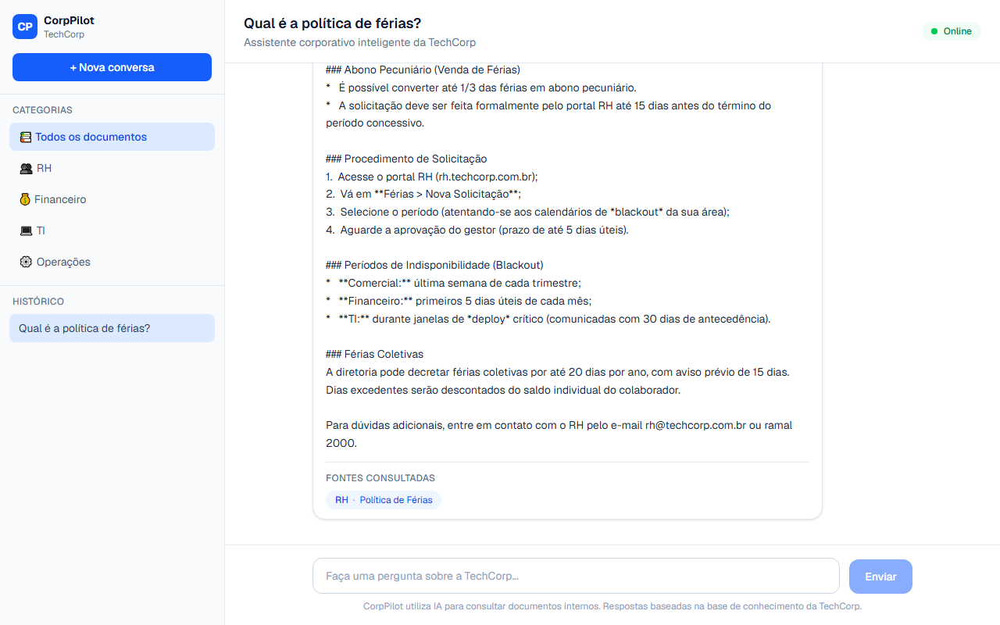
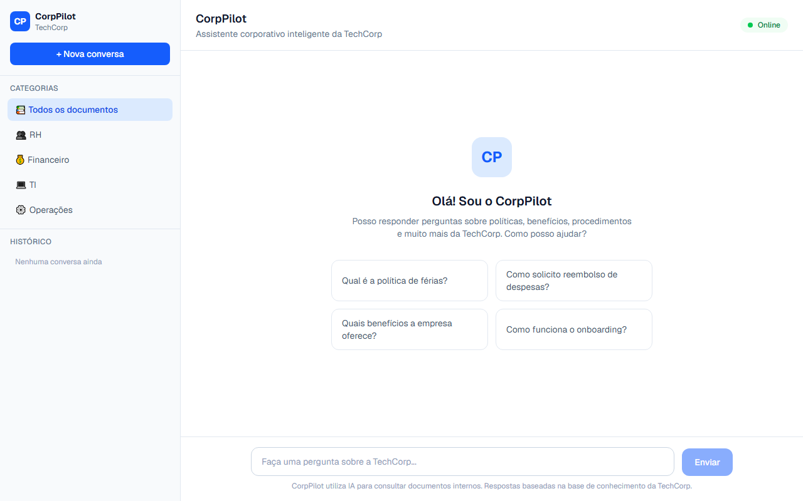

# CorpPilot — Copiloto Corporativo com IA

Assistente inteligente que permite colaboradores da **TechCorp** consultarem informações corporativas em linguagem natural.

- **Demo:** [corppilot.vercel.app](https://corppilot.vercel.app)
- **Repositório:** [github.com/bsantana/corppilot](https://github.com/bsantana/corppilot)

## Screenshots






## Tecnologias

- **Next.js 16** — Framework React com App Router
- **TypeScript** — Tipagem estática
- **Tailwind CSS 4** — Estilização
- **Google Gemini 3.1 Flash-Lite** — Modelo de linguagem (funcionalidade principal)
- **Vercel** — Deploy e hospedagem

## Ferramentas de IA no Desenvolvimento

| Ferramenta | Uso no Projeto |
|------------|----------------|
| **Cursor** | Geração de componentes, API routes, base de conhecimento, documentação |
| **Google Gemini API** | Funcionalidade principal do produto (chat com RAG) |
| **ChatGPT/Claude** | Criação dos documentos corporativos simulados |

Evidências de uso de IA durante o desenvolvimento estão em [`docs/evidencias-ia/`](./docs/evidencias-ia/).

## Funcionalidades

- ✅ Chat em linguagem natural
- ✅ Base de conhecimento com 9 documentos corporativos (RH, Financeiro, TI, Operações)
- ✅ Citação de fontes nas respostas
- ✅ Histórico de conversas (localStorage)
- ✅ Categorias de documentos com perguntas sugeridas
- ✅ API de resumo de documentos
- ✅ Busca por relevância lexical

## Como Executar Localmente

```bash
git clone https://github.com/bsantana/corppilot
cd corppilot
npm install
cp .env.example .env.local
```

Edite `.env.local` e adicione sua `GEMINI_API_KEY`:

```
GEMINI_API_KEY=sua-chave-aqui
GEMINI_MODEL=gemini-3.1-flash-lite
```

```bash
npm run dev
```

Acesse [http://localhost:3000](http://localhost:3000)

## Base de Conhecimento

Documentos fictícios da empresa **TechCorp** em `/docs`:

```
docs/
├── rh/           (política de férias, benefícios, código de conduta)
├── financeiro/   (reembolso, viagens)
├── ti/           (acesso a sistemas, segurança)
└── operacoes/    (onboarding, procedimentos gerais)
```

## Documentação de Entrega

| Documento | Descrição |
|-----------|-----------|
| [`docs/SPECS.md`](./docs/SPECS.md) | Especificação técnica |
| [`docs/ENTREGA.md`](./docs/ENTREGA.md) | Checklist de entrega |
| [`docs/PARTE-TEORICA.md`](./docs/PARTE-TEORICA.md) | Documento teórico |
| [`entrega/`](./entrega/) | Pacote de entrega organizado |
| [`docs/evidencias-ia/`](./docs/evidencias-ia/) | Evidências de IA no desenvolvimento |

## Autor

Bruno Santana — IA Generativa Aplicada ao Desenvolvimento
